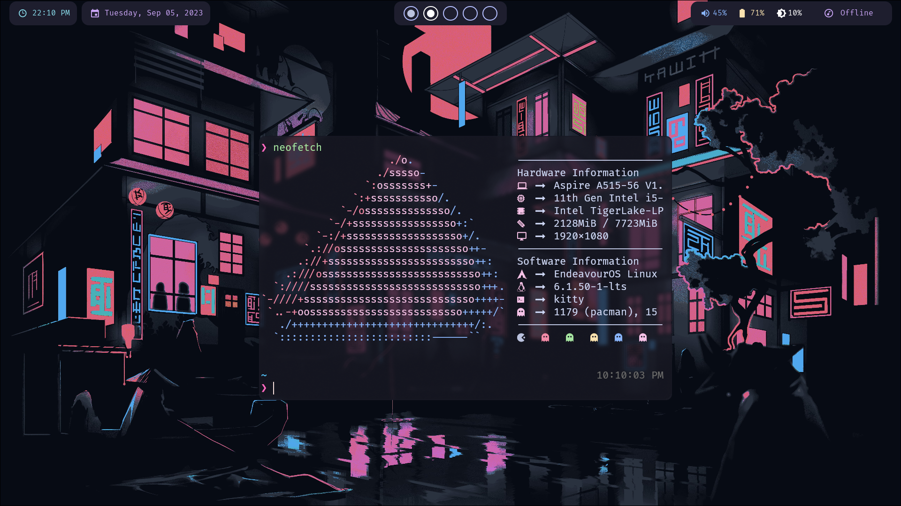

# Hyprland dotfiles



* Window Manager: [Hyprland][1]
* Top Bar: [Eww][2]
* Notification Daemon: [dunst][3]
* Terminal: [kitty][6]
* App launcher: [Rofi][4]
* Wallpaper Daemon: [swww][7]
* Wallpaper is made by me
* Fetch: Neofetch

Rofi and dunst theme is a slightly edited version of the catppuccin themes for [rofi][8] and [dunst][9].
Eww bar theme is taken from the [catppuccin waybar theme][10]

Waybar config was based on one of the [examples][12] on the [waybar wiki](https://github.com/Alexays/Waybar/wiki/Examples).

Hyprland Theme: [catppuccin/hyprland][11]

Additional Packages:
```
jq brightnessctl pamixer grim slurp
```


[1]: https://hyprland.org/
[2]: https://github.com/elkowar/eww
[3]: https://github.com/dunst-project/dunst
[4]: https://github.com/davatorium/rofi
[5]: https://www.reddit.com/r/PixelArt/comments/dulogi/ae86/
[6]: https://sw.kovidgoyal.net/kitty/
[7]: https://github.com/Horus645/swww
[8]: https://github.com/catppuccin/rofi
[9]: https://github.com/catppuccin/dunst
[10]: https://github.com/catppuccin/waybar
[11]: https://github.com/catppuccin/hyprland
[12]: https://github.com/rbnis/legacy-dotfiles/tree/master/.config/waybar

